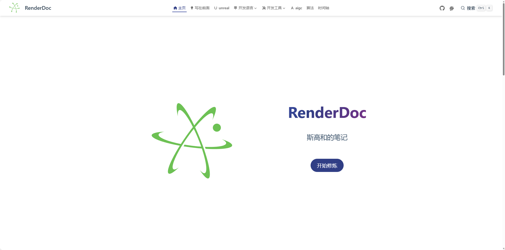
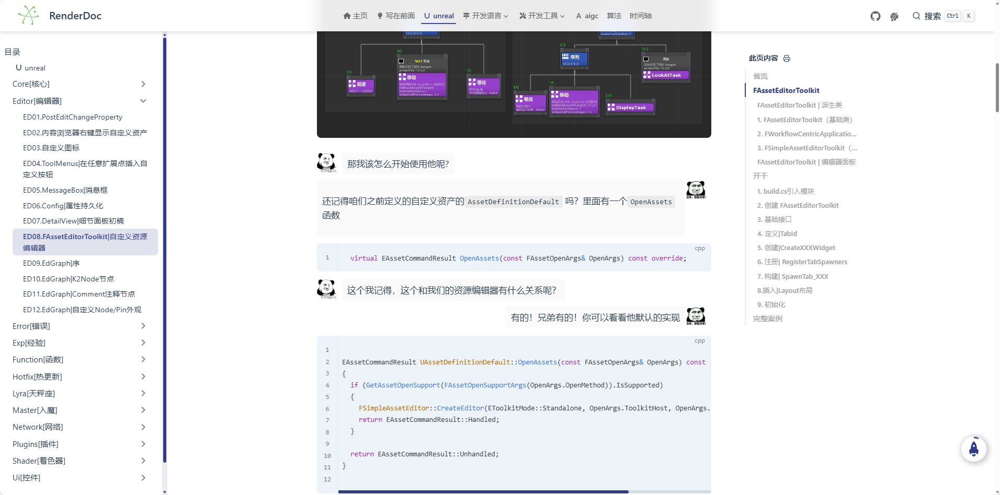
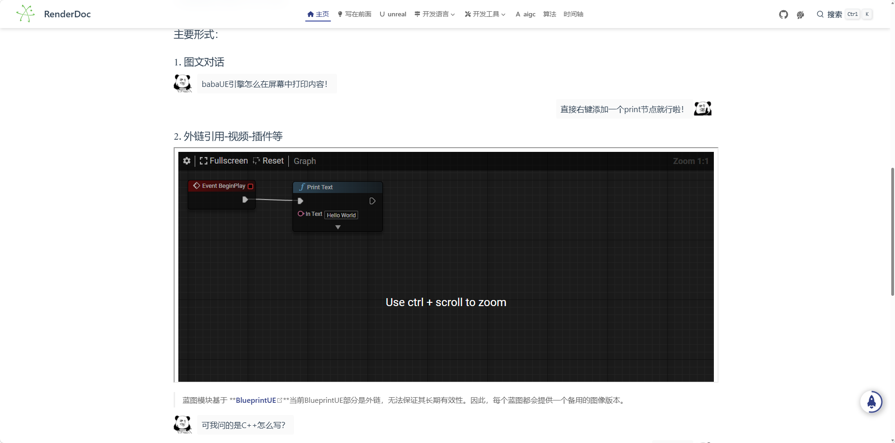
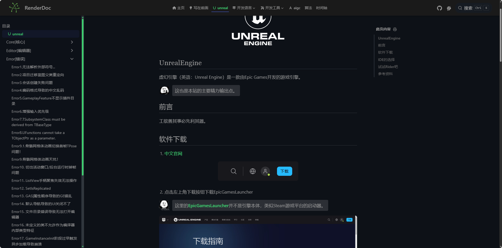

<p align="center">
  
</p>

<h1 align="center">RenderDoc</h1>

<p align="center">
  个人技术开发日志 —— 建模 / 渲染 / UE4-UE5 / 编程语言 / 工具链
</p>

<p align="center">
  <a href="http://renderdoc.space/"></a>
  <a href="https://vuepress.vuejs.org/"></a>
  <a href="https://www.typescriptlang.org/"></a>
  <a href="https://theme-hope.vuejs.press/zh/"></a>
  
</p>

<p align="center">
  <a href="#-功能">功能</a> •
  <a href="#-界面截图">界面截图</a> •
  <a href="#-快速开始">快速开始</a> •
  <a href="#-项目结构">项目结构</a> •
  <a href="#-技术栈">技术栈</a> •
  <a href="#-部署">部署</a> •
  <a href="#-常见问题">常见问题</a>
</p>

<br>

RenderDoc 是基于 [VuePress](https://vuepress.vuejs.org/) 与 [theme-hope](https://theme-hope.vuejs.press/zh/) 构建的个人技术文档站点。虽然被称为技术站，却更像是我的个人开发日志，主要记录建模、渲染技术、光线追踪、UE4/UE5、各类编程语言以及工具使用等综合技术内容。

---

## 功能

- **暗色模式** — 一键切换明暗主题，阅读更舒适
- **全文搜索** — 快速定位感兴趣的内容
- **评论交流** — 基于 GitHub Discussions 的 Giscus 评论
- **PWA 离线支持** — 可安装为应用，随时离线翻阅
- **页面加密** — 敏感页面可设置访问密码

---

## 界面截图

### 站点首页

<p align="center">
  
</p>
<p align="center">
  
</p>
<p align="center">
  
</p>

### 暗色主题

<p align="center">
  
</p>

---

## 快速开始

```bash
# 安装依赖
npm install

# 启动本地开发服务（默认 http://localhost:8080）
npm run docs:dev

# 构建静态站点（输出到 src/.vuepress/dist）
npm run docs:build
```

---

## 项目结构

```
RenderDoc/
├── src/                          # 文档源码
│   ├── .vuepress/                # VuePress 配置
│   │   ├── components/           # 自定义组件
│   │   ├── public/               # 静态资源
│   │   ├── styles/               # 全局样式
│   │   ├── config.ts             # 站点配置
│   │   ├── theme.ts              # 主题配置
│   │   ├── navbar.ts             # 导航栏配置
│   │   └── sidebar.ts            # 侧边栏配置
│   ├── preface/                  # 序言
│   ├── unreal/                   # UE4/UE5 开发
│   ├── language/                 # 编程语言（C++/Java/Lua/Markdown）
│   ├── tools/                    # 开发工具（Git/GitHub/IDE 等）
│   ├── algorithm/                # 算法
│   └── aigc/                     # AI 生成内容
├── .github/workflows/            # GitHub Actions 自动部署
└── package.json
```

---

## 技术栈

| 分类 | 技术 |
|------|------|
| 框架 | VuePress 2 + theme-hope |
| 语言 | TypeScript 5 / Vue 3 |
| 构建 | Webpack（可选 Vite） |
| 样式 | Sass |
| 功能 | 全文搜索 / Giscus 评论 / PWA |

---

## 部署

推送 `master` 分支后，由 GitHub Actions 自动构建文档并部署到 GitHub Pages（`gh-pages` 分支）。访问地址：<http://renderdoc.space/>

---

## 贡献

1. Fork 本仓库
2. 新建功能分支（`git checkout -b docs/new-article`）
3. 在对应板块下新增 Markdown 文章
4. 提交并推送（`git commit` / `git push`）
5. 发起 Pull Request

---

## 常见问题

**本地开发提示依赖缺失？**

运行 `npm install` 安装依赖后再启动。

**如何新增一篇文章？**

在对应板块目录下创建 Markdown 文件即可，侧边栏使用 `structure` 自动生成目录。

**如何加密某个页面？**

在 `src/.vuepress/theme.ts` 的 `encrypt.config` 中配置对应路径的访问密码。

---

## 许可协议

本项目使用 MIT 协议。
