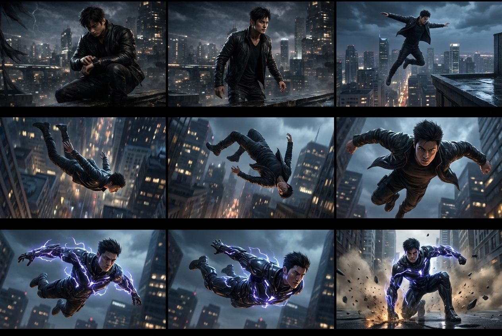
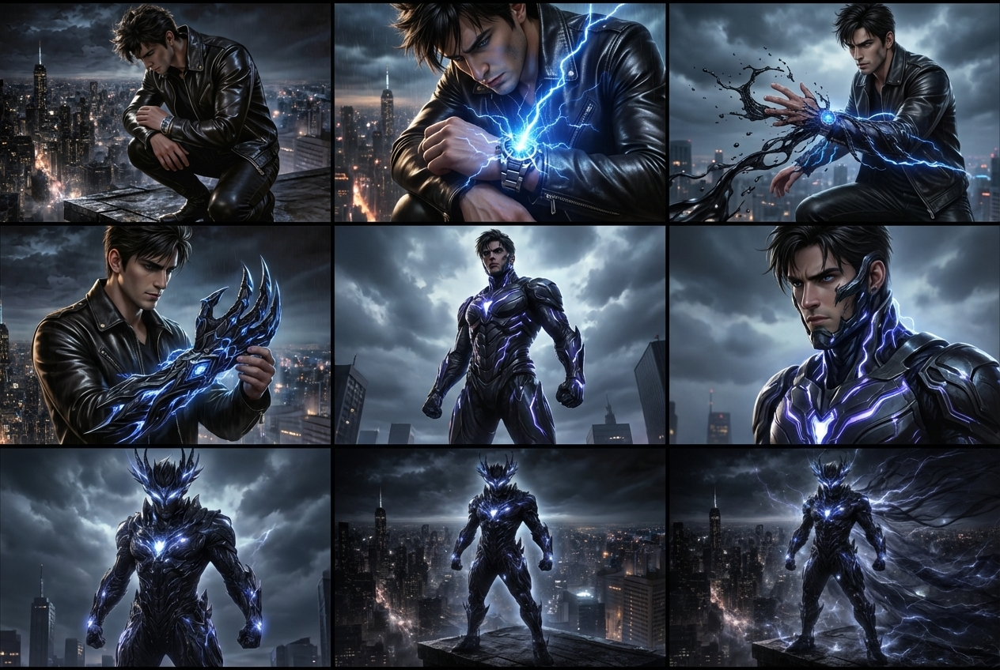

<chatmessage avatar="../../assets/emoji/hx.png" :avatarWidth="40">
BABA!我想用AI做短片需要了解哪些东西？
</chatmessage>

<chatmessage avatar="../../assets/emoji/bqb (2).png" :avatarWidth="40" alignLeft>

在影视制作、动画制作以及 AI 视频生成中，**镜头语言（Cinematography）** 是非常重要的基础知识。

</chatmessage>

## 镜头语言（Cinematic Language）

>是通过摄影机的构图、镜头运动、景别、角度、光影等视觉手段，将创作者的叙事意图、情绪表达和信息传递给观众的视觉表达体系。

<chatmessage avatar="../../assets/emoji/bqb (2).png" :avatarWidth="40" alignLeft>

在影视制作与AI视频生成中，镜头语言是“文字剧本`转化为`视觉画面”的核心桥梁。

</chatmessage>

---

## 视觉叙事的四个层级


### 1.故事（Stroy）

<chatmessage avatar="../../assets/emoji/bqb (2).png" :avatarWidth="40" alignLeft>

故事是叙事的最高层级，描述角色、事件与冲突的发展。

</chatmessage>

>例如

```text
一个年轻程序员加班到深夜，毫无灵感。
朋友打来电话邀请他打游戏，
他犹豫后决定放松一下，结果一夜未眠。
```

###  2.场景（Scene）

<chatmessage avatar="../../assets/emoji/bqb (2).png" :avatarWidth="40" alignLeft>

**场景（Scene）** 用于描述剧本中特定时间或地点发生的剧情段落。一个场景通常由 **多个镜头组成**。

</chatmessage>

>例如

```text
夜晚的出租屋电脑桌前
```

### 3.镜头（Shot）

<chatmessage avatar="../../assets/emoji/hx.png" :avatarWidth="40">
镜头是影视叙事的基本单位。
</chatmessage>

###  4.画面（Frame）

<chatmessage avatar="../../assets/emoji/hx.png" :avatarWidth="40">
这个我知道，画面是镜头中的单一瞬间，
</chatmessage>


<chatmessage avatar="../../assets/emoji/hx.png" :avatarWidth="40">

那么我们常说的用xx焦距、xx光圈、xxISO的镜头拍摄，算不算镜头组成的一部分术语？

</chatmessage>

<chatmessage avatar="../../assets/emoji/bqb (2).png" :avatarWidth="40" alignLeft>

可以算，但需要 更精确地分类。

</chatmessage>

---

## 摄影参数（Exposure / Camera Parameters）

<chatmessage avatar="../../assets/emoji/bqb (2).png" :avatarWidth="40" alignLeft>

可以算，但需要 更精确地分类。严格意义上来说：`焦距`、`光圈`、`ISO` 都属于`摄影参数（Exposure / Camera Parameters）`

</chatmessage>

### 焦距（Focal Length）

<chatmessage avatar="../../assets/emoji/bqb (2).png" :avatarWidth="40" alignLeft>

**焦距**决定镜头的视角范围和透视效果。

</chatmessage>

| 焦距        | 类型   | 特点     | 常见用途  |
|-----------|------|--------|-------|
| 14mm–24mm | 广角   | 视野宽广   | 建立环境  |
| 35mm      | 标准广角 | 接近人眼视角 | 对话场景  |
| 50mm      | 标准镜头 | 画面自然   | 人物镜头  |
| 85mm      | 中长焦  | 背景压缩明显 | 人像特写  |
| 135mm+    | 长焦   | 透视压缩强  | 远距离特写 |


<chatmessage avatar="../../assets/emoji/hx.png" :avatarWidth="40">
那么AI到底能不能理解焦距？
</chatmessage>

<chatmessage avatar="../../assets/emoji/bqb (1).png" :avatarWidth="40" alignLeft>

AI本身并不理解`XXmm`的意思，需要给一些客观事实的描述。

</chatmessage>


```text
摄影教学对比图，同一室内场景，一张木桌上放着一个红色苹果，画面从上到下展示不同焦距下的视觉效果，对比图横向排列，共五个画面，场景完全一致，苹果位置不变，只有镜头焦距变化。

从上到下分别为：

14mm 超广角镜头，透视夸张，桌子边缘明显拉伸，背景空间感很强。

35mm 广角镜头，空间自然，环境仍然较多。

50mm 标准镜头，接近人眼视角，画面自然。

85mm 中长焦镜头，背景开始压缩，苹果更加突出。

135mm 长焦镜头，透视压缩明显，背景虚化，苹果主体突出。

五个画面横向排列在同一张图中，清晰标注焦距：14mm / 35mm / 50mm / 85mm / 135mm，摄影教学风格，真实摄影效果，真实光影，高质量照片。
```


### 光圈（Aperture）

<chatmessage avatar="../../assets/emoji/bqb (1).png" :avatarWidth="40" alignLeft>

**光圈**决定画面的进光量以及景深效果。

</chatmessage>


| 光圈值         | 画面特点  | 常见用途 |
|-------------|-------|------|
| f/1.4 – f/2 | 背景虚化强 | 人物特写 |
| f/2.8 – f/4 | 中等景深  | 人物镜头 |
| f/5.6 – f/8 | 画面清晰  | 普通场景 |
| f/11+       | 深景深   | 风景   |


>即梦的4.6图像模型结果


<chatmessage avatar="../../assets/emoji/hx.png" :avatarWidth="40">
不同的AI生成结果不一样啊！上图除了曝光有点稍微的区别，景深其实并没有体现的非常明显。
</chatmessage>

<chatmessage avatar="../../assets/emoji/bqb (1).png" :avatarWidth="40" alignLeft>

AI更理解“看到什么”，而不是“镜头是什么”

</chatmessage>

```text
85mm lens
```
<chatmessage avatar="../../assets/emoji/bqb (1).png" :avatarWidth="40" alignLeft>

人脑看到上面的词汇，会自动脑部人像、 背景压缩、 浅景深、视角自然。而AI更容易理解直接描述视觉效果。

</chatmessage>

```cpp
close portrait, shallow depth of field, blurred background
```

<chatmessage avatar="../../assets/emoji/hx.png" :avatarWidth="40">
为毛啊？
</chatmessage>

<chatmessage avatar="../../assets/emoji/bqb (1).png" :avatarWidth="40" alignLeft>

因为 AI 是通过 图像特征训练的。模型记住的是： `wide shot` 、`close-up `、`blurred background` 、`city skyline`

</chatmessage>

>Prompt推荐结构

```text
景别 + 主体 + 环境 + 视觉效果
Medium shot, young man sitting at desk, computer screen glowing, messy room, shallow depth of field
```

>而不是

```text
50mm lens shot of a man
```

---

## 分镜脚本（Storyboard）

<chatmessage avatar="../../assets/emoji/hx.png" :avatarWidth="40">
问题又来了，为什么需要分镜？
</chatmessage>

<chatmessage avatar="../../assets/emoji/bqb (2).png" :avatarWidth="40" alignLeft>

**分镜脚本（Storyboard）** 是影视制作的重要工具，用于在拍摄前规划画面。

</chatmessage>

>标准传统分镜表

| 镜头编号 | 时长 | 景别  | 运镜       | 画面描述   | 角色动作   | 对白 | 音效    |
|------|----|-----|----------|--------|--------|----|-------|
| 1.1  | 3s | WS  | Aerial   | 城市夜景   | 无      | 无  | 城市环境声 |
| 1.2  | 3s | MS  | Dolly In | 男主站在天台 | 男主看向远方 | 无  | 风声    |
| 1.3  | 2s | CU  | Push     | 男主看向手腕 | 抬起左手   | 无  | 轻微电子音 |
| 1.4  | 2s | ECU | Static   | 手环特写   | 手环亮起   | 无  | 能量启动音 |

---

### 镜头编号（Shot Number）

<chatmessage avatar="../../assets/emoji/new2.png" :avatarWidth="40" alignLeft>

镜头编号用于管理分镜结构，方便剪辑、制作与沟通。通常使用 **场景号 + 镜头号** 的形式：

</chatmessage>

>示例分镜表：

| 镜头编号 | 景别  | 画面内容     |
|------|-----|----------|
| 1.1  | WS  | 城市夜景建立镜头 |
| 1.2  | MS  | 男主站在天台   |
| 1.3  | CU  | 男主看向手腕   |
| 1.4  | ECU | 手环亮起     |

---

### 景别（Shot Size）

<chatmessage avatar="../../assets/emoji/new5.png" :avatarWidth="40" alignLeft>

**景别**指画面中主体在画面中的大小比例，是分镜设计中最基础的概念之一。

</chatmessage>


>不同景别会影响观众对 **环境、人物和情绪** 的感知。

| 中文名称    | 英文名称                  | 缩写      | 画面范围          | 主要作用       | 常见使用场景      |
|---------|-----------------------|---------|---------------|------------|-------------|
| 超远景     | Extreme Long Shot     | ELS     | 人物非常小，环境占绝大部分 | 建立宏大空间与世界观 | 城市、战场、宇宙、航拍 |
| 远景 / 全景 | Long Shot / Wide Shot | LS / WS | 人物全身可见        | 展示人物与环境关系  | 人物出场、行动开始   |
| 中远景     | Medium Long Shot      | MLS     | 人物大约膝盖以上      | 兼顾动作与环境    | 行走、战斗准备     |
| 中景      | Medium Shot           | MS      | 人物腰部以上        | 表现人物交流与动作  | 对话场景        |
| 中近景     | Medium Close Up       | MCU     | 胸部以上          | 表情与情绪开始突出  | 情绪交流        |
| 近景      | Close Up              | CU      | 头部或面部         | 强调情绪细节     | 紧张、震惊、思考    |
| 大特写     | Extreme Close Up      | ECU     | 局部细节（眼睛、手、物件） | 突出关键细节     | 按按钮、流泪、手环启动 |


### 镜头角度（Camera Angle）

<chatmessage avatar="../../assets/emoji/bqb (1).png" :avatarWidth="40" alignLeft>

**镜头角度**指摄影机相对于主体的位置与高度。

</chatmessage>


>不同角度可以影响观众对角色的心理感受。

| 中文名称 | 英文名称            | 缩写  | 描述           | 常见用途 |
|------|-----------------|-----|--------------|------|
| 平视   | Eye Level       | EL  | 摄影机与人物视线高度一致 | 自然对话 |
| 俯视   | High Angle      | HA  | 摄影机从上向下拍     | 表现弱小 |
| 仰视   | Low Angle       | LA  | 摄影机从下向上拍     | 表现强大 |
| 鸟瞰   | Bird's Eye View | BEV | 从正上方拍摄       | 展示空间 |
| 虫视   | Worm's Eye View | WEV | 从极低角度拍摄      | 强调压迫 |
| 倾斜   | Dutch Angle     | DA  | 镜头倾斜         | 紧张不安 |
| 过肩视角 | Over Shoulder   | OTS | 从角色肩膀后拍      | 对话场景 |
| 主观视角 | POV             | POV | 从角色视角拍摄      | 代入感  |


### 运镜（Camera Movement）

<chatmessage avatar="../../assets/emoji/bqb (2).png" :avatarWidth="40" alignLeft>

不同运镜会影响画面的节奏、情绪以及叙事方式。

</chatmessage>

> 常见电影运镜

| 中文名称 | 英文名称      | 缩写        | 描述         | 常见用途   |
|------|-----------|-----------|------------|--------|
| 推镜头  | Push In   | Push      | 摄影机向主体靠近   | 强化情绪   |
| 拉镜头  | Pull Out  | Pull      | 摄影机远离主体    | 展示环境   |
| 横摇   | Pan       | Pan       | 摄影机左右旋转    | 展示空间   |
| 俯仰   | Tilt      | Tilt      | 摄影机上下旋转    | 展示高度   |
| 跟拍   | Follow    | Follow    | 摄影机跟随主体移动  | 动作场景   |
| 平移   | Truck     | Truck     | 摄影机左右移动    | 展示场景   |
| 前移   | Dolly In  | Dolly     | 摄影机向前移动    | 进入场景   |
| 后移   | Dolly Out | Dolly Out | 摄影机向后移动    | 拉开空间   |
| 升降   | Boom      | Boom      | 摄影机上下移动    | 强化空间   |
| 环绕   | Orbit     | Orbit     | 摄影机围绕主体旋转  | 强化视觉冲击 |
| 手持   | Handheld  | HH        | 模拟手持摄像机    | 紧张氛围   |
| 稳定跟随 | Steadicam | Steadicam | 稳定移动镜头     | 动态场景   |
| 航拍   | Aerial    | Aerial    | 空中拍摄       | 建立环境   |
| 主观移动 | POV Move  | POV       | 模拟人物视角移动   | 沉浸体验   |
| 变焦   | Zoom      | Zoom      | 改变焦距而非移动相机 | 突出主体   |


<chatmessage avatar="../../assets/emoji/hx.png" :avatarWidth="40">
问题来了，我用分镜表的描述让AI生成画面，出现了一些莫名其妙的镜头！
</chatmessage>

```text
根据两张参考图生成电影级九宫格分镜，用于动画导演预演。

参考：

图1为场景开始的首帧参考，包含角色与城市天台环境。
图2为角色最终装甲形象参考，仅用于装甲设计参考，九宫格中的场景环境仍然保持当前城市环境，最终落地画面为街景地面环境。

故事设定：

主角独自坐在高楼天台边缘俯视城市夜景。随后起身并从天台边缘跳下，在高速坠落过程中启动手腕装置完成装甲变身。角色在空中完成身体翻转并进入头朝下的俯冲姿态，在高速下坠中逐渐完成装甲生成。最终角色落地在街道地面，以参考图2姿势落地（单膝落地）。

分镜布局：

生成一个 3×3 九宫格分镜，共9个画面。
分镜按照从左到右、从上到下排列。
每个分镜内部必须是 **标准16:9电影画幅**。
所有分镜尺寸一致，排列均匀。

动作发展：

第一排（情绪建立）

1. 主角坐在高楼天台边缘俯视城市。
2. 主角站起并走向天台边缘。
3. 主角从天台边缘纵身跃下。

第二排（动作发展）

4. 主角进入自由落体，高楼快速远离。
5. 主角在空中翻转身体。
6. 低机位仰视镜头：镜头从下方向上拍摄角色高速坠落。角色完成翻转并进入头朝下的俯冲姿态，面部朝向镜头方向。角色启动手腕装置，装甲开始生成。

第三排（变身完成）
7. 装甲结构在坠落过程中继续覆盖身体。
8. 角色接近地面，装甲基本完成。
9. 角色落地在街景地面，产生冲击烟尘与碎石飞溅，以英雄式单膝跪地姿态完成最终变身。地面环境为街道、建筑与灯光，延续夜晚城市风格，与前方高楼环境有自然切换。

视觉风格：
整体为超写实电影风格，接近电影分镜概念设计。画面具有真实光影、电影构图与动态感。

环境：
天台环境在前六格，街景地面环境在第九格落地画面。光照方向、环境氛围在整个九宫格中保持一致。

输出：
生成高分辨率九宫格分镜图。
仅包含画面内容。
不包含文字、不包含水印、不包含UI元素。
每格保持16:9横屏电影画幅。
```



<chatmessage avatar="../../assets/emoji/bqb (2).png" :avatarWidth="40" alignLeft>

抛开画面本身的鬼畜，你的提示词中大量出现了`过程型描述`,相当于AI去猜测的画面。

</chatmessage>

>再看一版提示词

```text
你是一位电影分镜设计师。用户将提供两张参考图：第一张是场景开始的首帧，第二张是角色完成装甲变形后的尾帧。你的任务是在保持同一角色、同一环境、同一装甲设计和同一光线风格的前提下，补全中间的关键变形阶段，并生成一张电影分镜九宫格图。

全局视觉规格：16:9横向画面，3×3 storyboard grid layout，每格为一个电影关键帧。画面风格为黑暗写实科幻环境，biotech armor fused with alien technology，black biomechanical armor，electric blue energy，dark purple glow，cinematic lighting，HDR，volumetric lighting，ultra realistic，PBR materials，4K IMAX quality，high detail，no text，no watermark。

九宫格分镜顺序：
Frame 1（首帧）：人物半蹲在地面，抬起左手腕注视未来科技手腕装置，微弱蓝光从装置照亮脸部下方。
Frame 2：手腕装置启动，蓝色能量从机械缝隙中爆发，电弧在装置周围跳动。
Frame 3：黑色液态生物机械金属从手腕装置喷出，开始包裹手掌与前臂。
Frame 4：手部装甲形成爪刃结构，黑色金属装甲锁定在手指与手掌。
Frame 5：装甲从胸口向背部与腰部扩散，蓝色能量沿装甲纹路传导。
Frame 6：装甲沿颈部与下颌向上攀爬，逐渐覆盖面部下半部分。
Frame 7：装甲头盔闭合锁定，蓝色能量眼睛点亮。
Frame 8：完整装甲战士站立，装甲能量纹路在全身流动。
Frame 9（尾帧）：完全变形的生物机械装甲战士站立在黑暗科幻环境中，蓝紫能量在装甲表面流动。

整张图必须是专业电影分镜板布局，每一格展示同一角色逐渐变形的连续阶段，保持角色设计和装甲结构一致。
```


