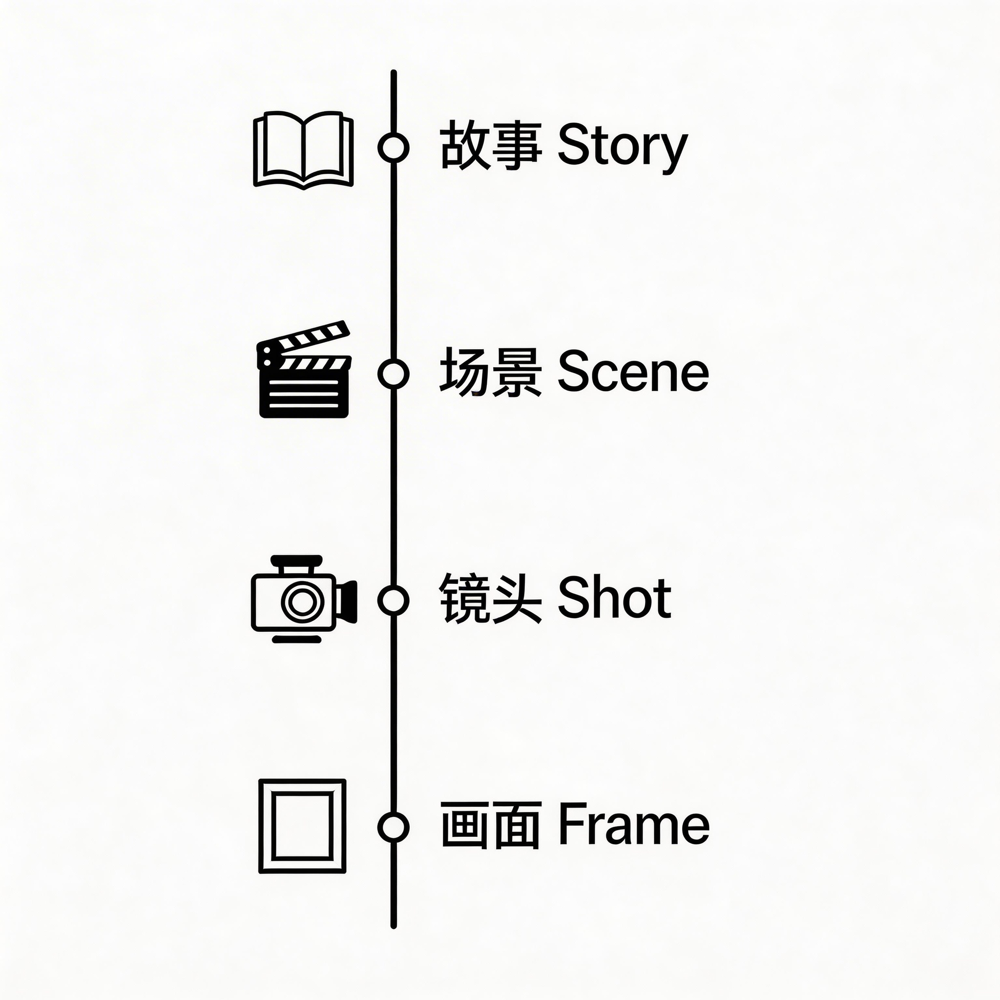
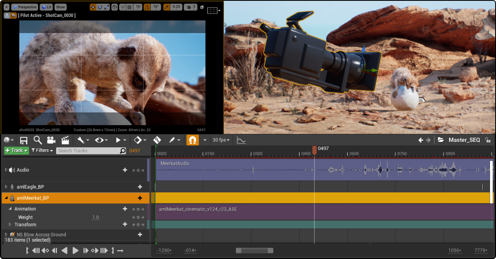
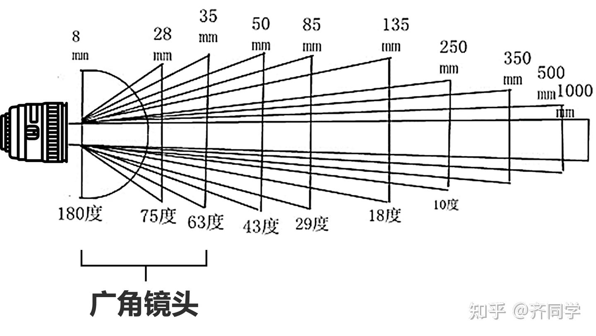
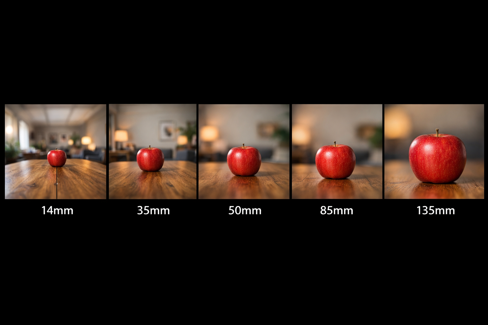
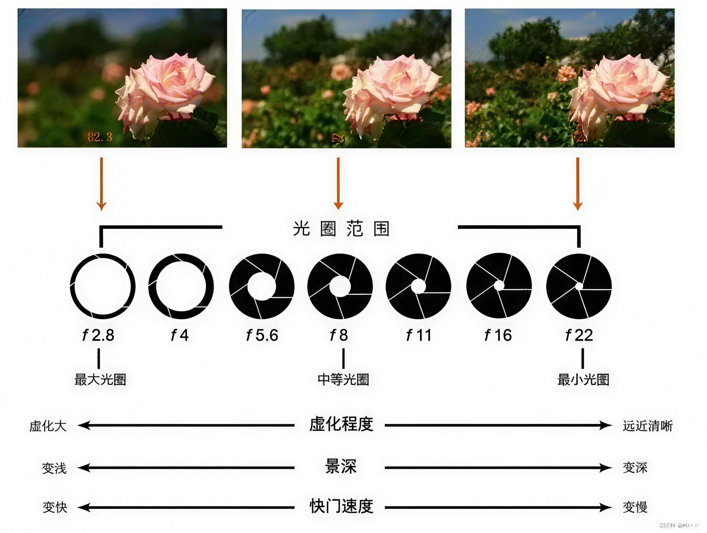
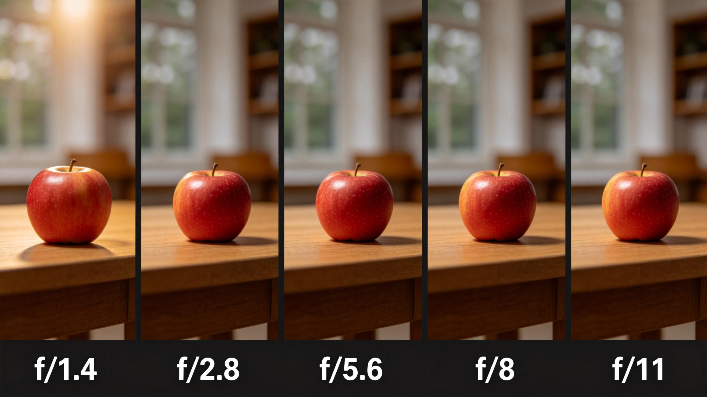

# 镜头语言基础

<chatmessage avatar="../../assets/emoji/hx.png" :avatarWidth="40">
BABA!我想用AI做短片需要了解哪些东西？
</chatmessage>

<chatmessage avatar="../../assets/emoji/bqb (2).png" :avatarWidth="40" alignLeft>

在影视制作、动画制作以及 AI 视频生成中，**镜头语言（Cinematography）** 是非常重要的基础知识。

</chatmessage>

- 画面信息
- 人物情绪
- 剧情节奏
- 空间关系
- 
 <chatmessage avatar="../../assets/emoji/new5.png" :avatarWidth="40" alignLeft>
一部完整的影视作品通常由以下结构组成：
</chatmessage>



---

### 景别（Shot Size）

<chatmessage avatar="../../assets/emoji/new5.png" :avatarWidth="40" alignLeft>

**景别**指画面中主体在画面中的大小比例，是分镜设计中最基础的概念之一。

</chatmessage>


不同景别会影响观众对 **环境、人物和情绪** 的感知。

| 中文名称    | 英文名称                  | 缩写      | 画面范围          | 主要作用       | 常见使用场景      |
|---------|-----------------------|---------|---------------|------------|-------------|
| 超远景     | Extreme Long Shot     | ELS     | 人物非常小，环境占绝大部分 | 建立宏大空间与世界观 | 城市、战场、宇宙、航拍 |
| 远景 / 全景 | Long Shot / Wide Shot | LS / WS | 人物全身可见        | 展示人物与环境关系  | 人物出场、行动开始   |
| 中远景     | Medium Long Shot      | MLS     | 人物大约膝盖以上      | 兼顾动作与环境    | 行走、战斗准备     |
| 中景      | Medium Shot           | MS      | 人物腰部以上        | 表现人物交流与动作  | 对话场景        |
| 中近景     | Medium Close Up       | MCU     | 胸部以上          | 表情与情绪开始突出  | 情绪交流        |
| 近景      | Close Up              | CU      | 头部或面部         | 强调情绪细节     | 紧张、震惊、思考    |
| 大特写     | Extreme Close Up      | ECU     | 局部细节（眼睛、手、物件） | 突出关键细节     | 按按钮、流泪、手环启动 |


---

<chatmessage avatar="../../assets/emoji/ybk.png" :avatarWidth="40" alignLeft>
除了景别之外，影视制作中还会使用一些特殊镜头结构。
</chatmessage>


| 中文名称 | 英文名称              | 缩写  | 说明          |
|------|-------------------|-----|-------------|
| 双人镜头 | Two Shot          | 2S  | 画面中同时出现两个人物 |
| 过肩镜头 | Over The Shoulder | OTS | 从角色肩膀后看另一角色 |
| 主观镜头 | Point Of View     | POV | 从角色视角看到的画面  |
| 插入镜头 | Insert Shot       | INS | 特写某个物体或关键细节 |
| 反应镜头 | Reaction Shot     | RS  | 表现人物的情绪反应   |

---

### 场景（Scene）


<chatmessage avatar="../../assets/emoji/bqb (2).png" :avatarWidth="40" alignLeft>

**场景（Scene）** 用于描述剧本中特定时间或地点发生的剧情段落。

</chatmessage>


<chatmessage avatar="../../assets/emoji/ybk.png" :avatarWidth="40" alignLeft>

一个场景通常由 **多个镜头组成**。

</chatmessage>




---

### 镜头编号（Shot Number）

<chatmessage avatar="../../assets/emoji/new2.png" :avatarWidth="40" alignLeft>

镜头编号用于管理分镜结构，方便剪辑、制作与沟通。通常使用 **场景号 + 镜头号** 的形式：

</chatmessage>

>示例分镜表：

| 镜头编号 | 景别  | 画面内容     |
|------|-----|----------|
| 1.1  | WS  | 城市夜景建立镜头 |
| 1.2  | MS  | 男主站在天台   |
| 1.3  | CU  | 男主看向手腕   |
| 1.4  | ECU | 手环亮起     |

---

### 主体（Subject）

<chatmessage avatar="../../assets/emoji/bqb (1).png" :avatarWidth="40" alignLeft>

**主体（Subject）** 指画面中最重要的视觉对象。

</chatmessage>


| 镜头   | 主体 |
|------|----|
| 城市航拍 | 城市 |
| 男主站立 | 男主 |
| 手环特写 | 手环 |

在镜头设计中，需要确保 **观众的注意力集中在主体上**。

---

### 焦距（Focal Length）

<chatmessage avatar="../../assets/emoji/bqb (2).png" :avatarWidth="40" alignLeft>

**焦距**决定镜头的视角范围和透视效果。

</chatmessage>

| 焦距        | 类型   | 特点     | 常见用途  |
|-----------|------|--------|-------|
| 14mm–24mm | 广角   | 视野宽广   | 建立环境  |
| 35mm      | 标准广角 | 接近人眼视角 | 对话场景  |
| 50mm      | 标准镜头 | 画面自然   | 人物镜头  |
| 85mm      | 中长焦  | 背景压缩明显 | 人像特写  |
| 135mm+    | 长焦   | 透视压缩强  | 远距离特写 |



<chatmessage avatar="../../assets/emoji/hx.png" :avatarWidth="40">
那么AI到底能不能理解焦距？
</chatmessage>

<chatmessage avatar="../../assets/emoji/bqb (1).png" :avatarWidth="40" alignLeft>

给一组提示词生成测试一下

</chatmessage>


```text
摄影教学对比图，同一室内场景，一张木桌上放着一个红色苹果，画面从上到下展示不同焦距下的视觉效果，对比图横向排列，共五个画面，场景完全一致，苹果位置不变，只有镜头焦距变化。

从上到下分别为：

14mm 超广角镜头，透视夸张，桌子边缘明显拉伸，背景空间感很强。

35mm 广角镜头，空间自然，环境仍然较多。

50mm 标准镜头，接近人眼视角，画面自然。

85mm 中长焦镜头，背景开始压缩，苹果更加突出。

135mm 长焦镜头，透视压缩明显，背景虚化，苹果主体突出。

五个画面横向排列在同一张图中，清晰标注焦距：14mm / 35mm / 50mm / 85mm / 135mm，摄影教学风格，真实摄影效果，真实光影，高质量照片。
```



<chatmessage avatar="../../assets/emoji/bqb (1).png" :avatarWidth="40" alignLeft>

目前来AI似乎对多少mm的镜头并总是理解的非常到位，需要自己称述一些画面表现。

</chatmessage>

---

### 光圈（Aperture）

<chatmessage avatar="../../assets/emoji/bqb (1).png" :avatarWidth="40" alignLeft>

**光圈**决定画面的进光量以及景深效果。

</chatmessage>


| 光圈值         | 画面特点  | 常见用途 |
|-------------|-------|------|
| f/1.4 – f/2 | 背景虚化强 | 人物特写 |
| f/2.8 – f/4 | 中等景深  | 人物镜头 |
| f/5.6 – f/8 | 画面清晰  | 普通场景 |
| f/11+       | 深景深   | 风景   |






---

### 运镜（Camera Movement）

<chatmessage avatar="../../assets/emoji/bqb (2).png" :avatarWidth="40" alignLeft>

不同运镜会影响画面的节奏、情绪以及叙事方式。

</chatmessage>

> 常见电影运镜

| 中文名称 | 英文名称      | 缩写        | 描述         | 常见用途   |
|------|-----------|-----------|------------|--------|
| 推镜头  | Push In   | Push      | 摄影机向主体靠近   | 强化情绪   |
| 拉镜头  | Pull Out  | Pull      | 摄影机远离主体    | 展示环境   |
| 横摇   | Pan       | Pan       | 摄影机左右旋转    | 展示空间   |
| 俯仰   | Tilt      | Tilt      | 摄影机上下旋转    | 展示高度   |
| 跟拍   | Follow    | Follow    | 摄影机跟随主体移动  | 动作场景   |
| 平移   | Truck     | Truck     | 摄影机左右移动    | 展示场景   |
| 前移   | Dolly In  | Dolly     | 摄影机向前移动    | 进入场景   |
| 后移   | Dolly Out | Dolly Out | 摄影机向后移动    | 拉开空间   |
| 升降   | Boom      | Boom      | 摄影机上下移动    | 强化空间   |
| 环绕   | Orbit     | Orbit     | 摄影机围绕主体旋转  | 强化视觉冲击 |
| 手持   | Handheld  | HH        | 模拟手持摄像机    | 紧张氛围   |
| 稳定跟随 | Steadicam | Steadicam | 稳定移动镜头     | 动态场景   |
| 航拍   | Aerial    | Aerial    | 空中拍摄       | 建立环境   |
| 主观移动 | POV Move  | POV       | 模拟人物视角移动   | 沉浸体验   |
| 变焦   | Zoom      | Zoom      | 改变焦距而非移动相机 | 突出主体   |

---

### 镜头角度（Camera Angle）

<chatmessage avatar="../../assets/emoji/bqb (1).png" :avatarWidth="40" alignLeft>

**镜头角度**指摄影机相对于主体的位置与高度。

</chatmessage>


>不同角度可以影响观众对角色的心理感受。

| 中文名称 | 英文名称            | 缩写  | 描述           | 常见用途 |
|------|-----------------|-----|--------------|------|
| 平视   | Eye Level       | EL  | 摄影机与人物视线高度一致 | 自然对话 |
| 俯视   | High Angle      | HA  | 摄影机从上向下拍     | 表现弱小 |
| 仰视   | Low Angle       | LA  | 摄影机从下向上拍     | 表现强大 |
| 鸟瞰   | Bird's Eye View | BEV | 从正上方拍摄       | 展示空间 |
| 虫视   | Worm's Eye View | WEV | 从极低角度拍摄      | 强调压迫 |
| 倾斜   | Dutch Angle     | DA  | 镜头倾斜         | 紧张不安 |
| 过肩视角 | Over Shoulder   | OTS | 从角色肩膀后拍      | 对话场景 |
| 主观视角 | POV             | POV | 从角色视角拍摄      | 代入感  |


---

###  分镜脚本（Storyboard）

<chatmessage avatar="../../assets/emoji/bqb (2).png" :avatarWidth="40" alignLeft>

**分镜脚本（Storyboard）** 是影视制作的重要工具，用于在拍摄前规划画面。

</chatmessage>


>标准分镜表结构

| 镜头编号 | 时长 | 景别  | 运镜       | 画面描述   | 角色动作   | 对白 | 音效    |
|------|----|-----|----------|--------|--------|----|-------|
| 1.1  | 3s | WS  | Aerial   | 城市夜景   | 无      | 无  | 城市环境声 |
| 1.2  | 3s | MS  | Dolly In | 男主站在天台 | 男主看向远方 | 无  | 风声    |
| 1.3  | 2s | CU  | Push     | 男主看向手腕 | 抬起左手   | 无  | 轻微电子音 |
| 1.4  | 2s | ECU | Static   | 手环特写   | 手环亮起   | 无  | 能量启动音 |

---


