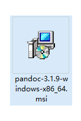
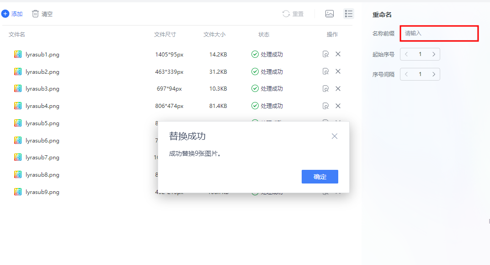
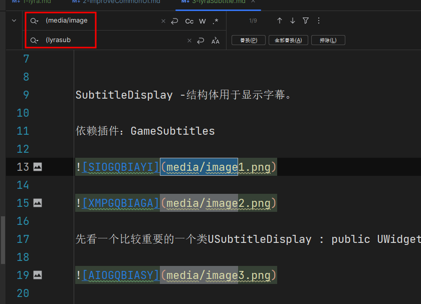

## word转md

<ChatMessage avatar="../../assets/emoji/hx.png" :avatarWidth="40">
Word怎么转成MD?
</ChatMessage>

<ChatMessage avatar=" ../../assets/emoji/bqb (1).png" :avatarWidth="40" alignLeft>
安排
</ChatMessage>

## 1.下载pandoc.exe

[https://github.com/jgm/pandoc/tree/3.1.9](https://github.com/jgm/pandoc/tree/3.1.9)

## 2.安装



## 3. Powershell或者CMD

<ChatMessage avatar=" ../../assets/emoji/bqb (1).png" :avatarWidth="40" alignLeft>
使用时，在要转的文档目录空白处shift+右键打开Powershell
</ChatMessage>


 
<ChatMessage avatar=" ../../assets/emoji/bqb (1).png" :avatarWidth="40" alignLeft>
输入命令后回车
</ChatMessage>

```
pandoc input.docx -o output.md
```


>请替换`input.docx`为你的Word文档文件名，`output.md`为你想要生成的Markdown文件名。


<GifWithButton src="../../assets/unrealgif/hpimpove6.gif"/>

## 4.批量导出图片


## 5.命名修改

<ChatMessage avatar=" ../../assets/emoji/bqb (1).png" :avatarWidth="40" alignLeft>
WPS或者其他工具批量重命名
</ChatMessage>




<ChatMessage avatar=" ../../assets/emoji/bqb (1).png" :avatarWidth="40" alignLeft>
最后打开MD替换名称前缀就OK了
</ChatMessage>


