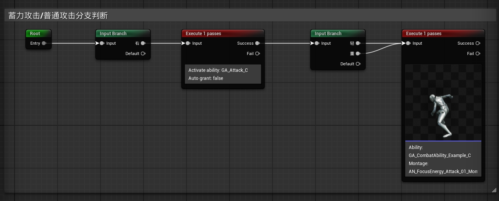
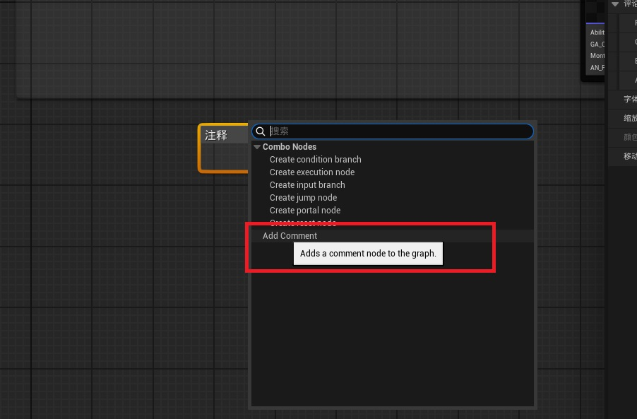

## UEdGraphNode_Comment

<chatmessage avatar="../../assets/emoji/hx.png" :avatarWidth="38">
现在要加入一个注释节点
</chatmessage>

<chatmessage avatar="../../assets/emoji/bqb (2).png" :avatarWidth="40" alignLeft >

很简单，使用 UE 内置 `Comment Node`

</chatmessage>




## 二、实现步骤

### **1** 新建`FEdGraphSchemaAction`
::: code-tabs#language

@tab NodeActions.h

```cpp
#pragma once

#include "CoreMinimal.h"
#include "EdGraph/EdGraphSchema.h"
#include "ComboNodeActions.generated.h"
/** Action to add a comment to the graph */
USTRUCT()
struct  FComboSchemaAction_AddComment : public FEdGraphSchemaAction
{
	GENERATED_BODY()
	
	FComboSchemaAction_AddComment() : FEdGraphSchemaAction() {}
	FComboSchemaAction_AddComment(FText InDescription, FText InToolTip)
		: FEdGraphSchemaAction(FText(), MoveTemp(InDescription), MoveTemp(InToolTip), 0)
	{
	}

	// FEdGraphSchemaAction interface
	virtual UEdGraphNode* PerformAction(class UEdGraph* ParentGraph, UEdGraphPin* FromPin, const FVector2D Location, bool bSelectNewNode = true) override final;
	// End of FEdGraphSchemaAction interface
};
```

@tab NodeActions.cpp
```cpp
UEdGraphNode* FComboSchemaAction_AddComment::PerformAction(class UEdGraph* ParentGraph, UEdGraphPin* FromPin,
	const FVector2D Location, bool bSelectNewNode)
{
	UEdGraphNode_Comment* const CommentTemplate = NewObject<UEdGraphNode_Comment>();

	FVector2D SpawnLocation = Location;
	FSlateRect Bounds;

	TSharedPtr<SGraphEditor> GraphEditorPtr = SGraphEditor::FindGraphEditorForGraph(ParentGraph);
	if (GraphEditorPtr.IsValid())
	{
		// If they have a selection, build a bounding box around the selection
		if (GraphEditorPtr->GetBoundsForSelectedNodes(/*out*/ Bounds, 50.0f))
		{
			CommentTemplate->SetBounds(Bounds);
			SpawnLocation.X = CommentTemplate->NodePosX;
			SpawnLocation.Y = CommentTemplate->NodePosY;
		}
		else
		{
			// Otherwise initialize a default comment at the user's cursor location.
			SpawnLocation = GraphEditorPtr->GetPasteLocation();
		}
	}

	UEdGraphNode* const NewNode = FEdGraphSchemaAction_NewNode::SpawnNodeFromTemplate<UEdGraphNode_Comment>(ParentGraph, CommentTemplate, SpawnLocation, bSelectNewNode);

	return NewNode;
}
```
:::

---

### **2** `UEdGraphSchema`派生类中重写注释`GetCreateCommentAction`节点

```cpp
 virtual TSharedPtr<FEdGraphSchemaAction> GetCreateCommentAction() const override
 {
 return TSharedPtr<FEdGraphSchemaAction>(static_cast<FEdGraphSchemaAction*>(new FComboSchemaAction_AddComment));
 }
```
---

### **3.** `FAssetEditorToolkit`派生类中添加创建命令

```cpp
void FComboGraphEditorApp::CreateCommandList()
{
    if (GraphEditorCommands.IsValid())
    {
        return;
    }
    GraphEditorCommands = MakeShareable(new FUICommandList);

    GraphEditorCommands->MapAction(FGraphEditorCommands::Get().CreateComment,
        FExecuteAction::CreateRaw(this, &FComboGraphEditorApp::OnCreateComment)
    );
}
```
### **4.** 与此同时在`Graph Events`委托注册`OnNodeTitleCommitted`支持`ReName`

```cpp
    SGraphEditor::FGraphEditorEvents GraphEvents;
    //注释支持修改的关键
    GraphEvents.OnTextCommitted = FOnNodeTextCommitted::CreateSP(this, &FComboGraphEditorApp::OnNodeTitleCommitted);
    
    void FComboGraphEditorApp::OnNodeTitleCommitted(const FText& NewText, ETextCommit::Type CommitInfo, UEdGraphNode* NodeBeingChanged)
{
    if (NodeBeingChanged)
    {
        const FScopedTransaction Transaction( FText::FromString("ReName") );
        NodeBeingChanged->Modify();
        NodeBeingChanged->OnRenameNode(NewText.ToString());
    }
}

```
<chatmessage avatar="../../assets/emoji/bqb (2).png" :avatarWidth="40" alignLeft >

什么！你不知道这个`GraphEvents`在什么地方注册？罚你回去看一眼[直通车](../editor_编辑器_/08-FAssetEditorToolkit.md)

</chatmessage>

### **5.**  细节面板中显示`UEdGraphNode_Comment`属性

```cpp
SGraphEditor::FGraphEditorEvents InEvents;
//注释支持修改的关键
InEvents.OnTextCommitted = FOnNodeTextCommitted::CreateSP(this, &FComboGraphEditorApp::OnNodeTitleCommitted);  
//修改选中后显示属性面板
InEvents.OnSelectionChanged = SGraphEditor::FOnSelectionChanged::CreateSP(this, &FComboGraphEditorApp::OnGraphSelectionChanged);
```

```cpp
void FSuperComboGraphAssetsEditor::OnGraphSelectionChanged(const TSet<UObject*>& NewSelection)
{
	if (!SuperComboGraphProperties.IsValid())
	{
		return;
	}
	for (UObject* Selection : NewSelection)
	{
		if (UEdGraphNode_Comment* CommentNode = Cast<UEdGraphNode_Comment>(Selection))
		{
			SuperComboGraphProperties->SetObject(CommentNode);
			return;
		}
		if (USuperComboGraphEdNodeBase* Node = Cast<USuperComboGraphEdNodeBase>(Selection))
		{
			// Root 节点：显示 Graph 本身
			if (Node && !Node->IsRootNode())
			{
				SuperComboGraphProperties->SetObject(Node->GetNodeData());
				return;
			}
		}
	}
	SuperComboGraphProperties->SetObject(SuperComboGraphObj);
}
```
### **6.** `UEdGraphSchema`派生类中注册Action,以便手动右键内容中可以创建注释节点



```cpp
void UComboGraphSchema::GetGraphContextActions(FGraphContextMenuBuilder& ContextMenuBuilder) const
{

    //TODO 其他节点菜单
	// Add the ability to create a comment to the context menu too for discoverability
	//右键菜单中显示添加注释节点
	{
		TSharedPtr<FComboSchemaAction_AddComment> Action = MakeShared<FComboSchemaAction_AddComment>(
			LOCTEXT("AddComment", "Add Comment"), LOCTEXT("AddComment_Tooltip", "Adds a comment node to the graph."));

		ContextMenuBuilder.AddAction(Action);
	}
}

```


