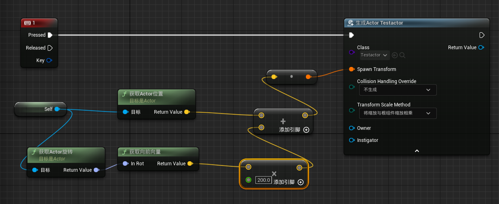

<chatmessage avatar="../../assets/emoji/hx.png" :avatarWidth="40" >

`SpawnActorFromClass`顾名思义，从类构建生成对象

</chatmessage>


### 简单实例

>角色按1生成一个球



<iframe src="https://blueprintue.com/render/tabw8zu8/" width="100%" height="500" scrolling="no" allowfullscreen></iframe>

### cpp

```cpp
	//获取玩家ActorforwardVector
	FVector forwardVector = GetActorForwardVector();
	//获取玩家ActorLocation
	FVector location = GetActorLocation();

	//ForwardVector*200+Location
	FVector const spawnLocation =forwardVector * 200 + location;

	UWorld* const World = GetWorld();
	//断言
	check(World);
	
	 World->SpawnActor<AActor>(CurrentTarget,spawnLocation,FRotator::ZeroRotator);
```


